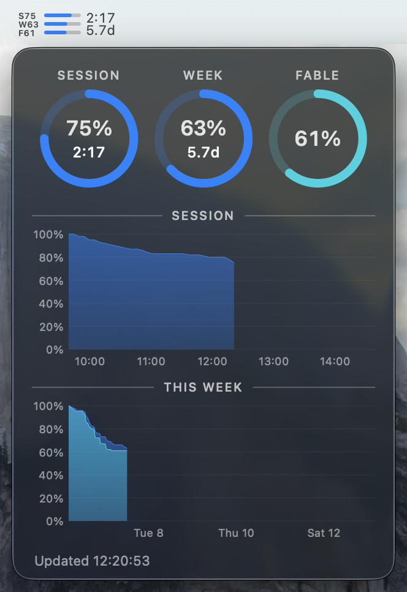

# Claude Usage — macOS menu bar

A compact menu bar readout of remaining Claude Code limits, in the style of
iStat-type system monitors: all three limits — session, week, Fable week — each
as a number next to a small bar gauge, laid out as columns (default) or as
stacked rows:

```
S 95% W 82% F 100%     <- columns layout
━━━━━ ━━━━━ ━━━━━━━━
```

Left-click opens a history panel with usage graphs; right-click (or
control-click) opens the settings menu. A two-line "Time Remaining" cell
appears after the gauges by default: session time left as `H:MM` (e.g.
`2:39`) over week time left in days (e.g. `2.3d`), in large text that
follows the menu bar appearance.



Polling is **free**: `claude --safe-mode -p "/usage"` is handled entirely
client-side. Measured with `--output-format json`, it reports `num_turns: 0`,
`duration_api_ms: 0`, and `total_cost_usd: 0`; 22 consecutive calls did not
move the session percentage. (The same prompt *without* the leading slash is
an ordinary prompt and costs ~$0.04.) Besides the fixed interval, a poll
fires seconds after each session or week reset boundary, so a rollover shows
fresh numbers immediately; until that poll lands, the display freezes the
last real reading with its countdown pinned at `0:00`.

## Architecture

    parser/claude_usage.py       scrapes `claude -p /usage` -> JSON      (no deps, py3.9+)
    Sources/ClaudeUsageBarCore/  AppKit NSStatusItem, polls the parser   (Swift 5.9+)
    Sources/ClaudeUsageBar/      app entry point (AppDelegate, NSApp.run())

The parser is deliberately separate and standalone: text-scraping an
undocumented command is the fragile part, so it can be run, diffed and tested
without launching the GUI.

```sh
parser/claude_usage.py --indent 2      # the JSON contract
parser/claude_usage.py --raw           # underlying text, to eyeball changes
parser/claude_usage.py --fixture f.txt # parse a saved capture
python3 tests/test_parser.py           # fixture tests
swift test                             # Swift-side unit tests (XCTest)
```

### Guarding against silent wrongness

A scraper that quietly reports the wrong number is worse than one that fails.
The parser matches tier lines generically (`Current <label>: N% used`) so a new
or renamed model tier is still captured, and sets `schema_ok: false` with
`missing_keys` if the lines it depends on disappear. The app then shows an
orange `?` rather than a stale or invented percentage.

Note `activity` carries `local_only: true` — `/usage` states the request and
session counts cover local sessions on this machine only. The percentages
themselves are server-side.

## Requirements

- macOS 13 or later
- Xcode Command Line Tools — `xcode-select --install`
- Claude Code, installed and signed in

No Python install is needed: `/usr/bin/python3` is a shim that requires the
Command Line Tools, and those are already required to compile the Swift, so
building the app implies a working interpreter. Nothing from Homebrew is used.

Tested against a subscription plan. If an API-key account's `/usage` output
lacks the expected lines, the app shows `?` and `schema_ok` reports what was
missed.

## Build

```sh
git clone <repo> && cd claude-usage-bar
./build.py --install --run   # -> /Applications, and launch
```

Or `./build.py` alone to leave it in `dist/`.

Full Xcode is *not* needed to build: SwiftPM compiles the binary and
`build.py` assembles the `.app` by hand, ad-hoc signed. The parser is copied
into `Contents/Resources`, so **rebuild after editing
`parser/claude_usage.py`**. Running the Swift tests (`swift test`) does need
Xcode.app, though — XCTest ships as part of Xcode, not the Command Line
Tools.

Building locally keeps distribution simple: the app picks up the host
architecture, and a locally built bundle carries no quarantine flag, so there
is no Gatekeeper prompt, Developer ID, or notarisation involved.

### Keeping privacy grants across rebuilds

Every ad-hoc re-sign (`--sign -`, the default) mints a new code identity, so
macOS treats each rebuild as a different app and resets its TCC privacy
grants (network volume access, media library, and the rest). To keep grants
stable across rebuilds, create a persistent self-signed certificate
once — Keychain Access > Certificate Assistant > Create a Certificate, type
"Code Signing", e.g. named "Claude Usage Dev" — then build with:

```sh
./build.py --sign "Claude Usage Dev"
```

## Menu

Right-click (or control-click) the status item for the full breakdown, with
reset countdowns, 7-day local activity, and:

- **Layout** — Columns (default) or Rows
- **Color** — eight iStat-style palette entries (Blue default, Green, Yellow,
  Orange, Red, Pink, Purple, Graphite), used for the bar fill
- **Numbers** — Remaining % (default) or Used %, applied to the menu bar
  numbers and fills and to the panel's rings and charts
- **Refresh every** — 30s / 1m / 5m / 15m (default 1m)
- **Time Remaining** — toggles the menu bar countdown cell described above;
  on by default
- Refresh Now (⌘R), Copy /usage Output (⌘C), Clear History…, Open at Login,
  Quit (⌘Q)

Colour is used sparingly, the native convention: the chosen palette colour (or
default label colour text) above 25% remaining, orange at ≤25%, red at ≤10%.

A custom bar colour outside the palette can be set directly:

```sh
defaults write com.claudeusagebar.app barColorHex RRGGBB
defaults delete com.claudeusagebar.app barColorHex   # remove the override
```

`barColorHex` silently overrides whichever palette entry the Color menu shows
checked; removing it restores that entry's colour.

## History panel

Left-click the status item to open an iStat-style panel with usage history.

Three ring gauges (session, week, Fable) show each metric's percentage — in
the mode the Numbers preference selects — as a clockwise arc from 12
o'clock, with the value and a small caption (the session/week countdown, or
"FABLE") in the center.

Below the rings: a chart for the current 5-hour session window, and a
two-series chart for the current 7-day week window (all models in the chosen
bar colour, Fable in teal). Each chart has a y-axis gutter labelled
0/20/40/60/80/100% and x-axis ticks that snap to round boundaries — hour
marks for the session chart, local midnights every 2 days for the week chart.

Hovering over a chart snaps to the nearest sample: a hairline rule, a dot
per series, and a readout box with the time over one swatched row per
series — named on the week chart ("week 82%", "fable 100%") — flipping to
stay clear of the right and top edges.

The panel's left edge lines up with the status item's left edge, flipping to
right-aligned near a screen edge — the same rule `NSMenu` uses. Click
outside the panel, or click the status item again, to dismiss it.

A chart shows "collecting history…" until it has at least two samples to
draw a line between — a fresh install, or a metric `/usage` has stopped
reporting. Gaps left by the Mac sleeping are interpolated rather than shown
as a break in the line.

## History storage

Every poll that returns a trustworthy reading (the same schema check
described above) appends one row to a small SQLite database at
`~/Library/Application Support/com.claudeusagebar.app/history.sqlite`:

```sql
CREATE TABLE samples (
  ts            INTEGER PRIMARY KEY, -- unix seconds
  session_start INTEGER NOT NULL,    -- unix seconds at the start of this row's 5h session window
  session       REAL NOT NULL,       -- used % at ts
  week          REAL NOT NULL,
  fable         REAL NOT NULL
) STRICT
```

`ts` is unix seconds, so history is immune to timezone and DST changes; the
`session`/`week`/`fable` columns are the used % values `/usage` reported,
unchanged — the displayed value is derived only when a chart draws them.
`/usage` gives no session identifier, so one is derived: `session_start` is
the unix-seconds start of the row's 5-hour session window (the reset boundary
minus 5h), which stands in for a session id since two samples belong to the
same session iff they derive the same value.

Nothing in the schema is nullable — a poll is recorded whole or not at all,
skipped entirely unless the reading is trustworthy, all three metrics are
present, and the session id is derivable. A schema change (like this one)
bumps `PRAGMA user_version` and recreates the table from scratch: history
recorded before the version bump is dropped, not migrated.

The default one-minute poll writes 25-30 MB per year, small enough that
nothing is ever pruned; "Clear History…" in the menu deletes
every row instead. The database runs in WAL mode with exclusive locking, so a
`-wal` sidecar file can sit next to `history.sqlite` while the app is
running; a clean quit checkpoints and removes it.

## Binary resolution

A GUI app launched from Finder gets a minimal `PATH` that does **not** include
`~/.local/bin`, `claude`'s default install location. Both the interpreter
and the CLI
are therefore resolved by absolute path, falling back to a non-login
`zsh -c command -v` (so a background poller never sources login dotfiles).
Stock `/usr/bin/python3` (3.9.6) is preferred so no Homebrew install is needed.

Overrides for non-standard installs:

```sh
defaults write com.claudeusagebar.app claudeBin  /path/to/claude
defaults write com.claudeusagebar.app pythonBin  /path/to/python3
defaults write com.claudeusagebar.app parserPath /path/to/claude_usage.py
```

## Caveats

- Depends on the human-readable format of `/usage`, which is undocumented;
  `schema_ok` and the fixture tests detect format changes.
- "Open at Login" uses `SMAppService`, which requires a signed app installed
  in `/Applications`; the app surfaces registration errors rather than
  failing silently.
